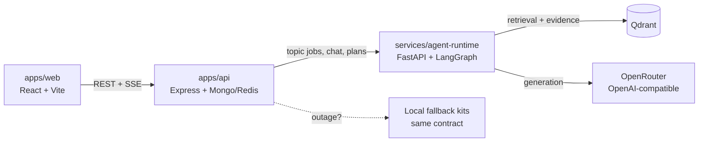

# EduSwarm — the multi-agent AI learning platform

EduSwarm turns exam syllabi and engineering roadmaps into an **intelligent study
operating system**: a Dean-led agent team generates evidence-gated study kits,
while a deterministic learning-intelligence engine tracks mastery, schedules
spaced reviews, plans each day, runs timed mocks, and judges code — with or
without the LLM runtime online.

**Universes:** GATE CSE (PYQ-first) · Full-stack Web Development · AI/ML Engineering.

## Why it stands out

| Pillar | What learners get |
|---|---|
| **Command center** | XP + levels, streaks, mastery map per module, ranked next actions, insights, weekly momentum, and a time-boxed *Today's Mission* |
| **Evidence-gated lessons** | LangGraph pipeline (Dean → Researcher → Notes → Practice → Fact-Checker → Publisher) publishes only claim-cited packages; local fallback keeps learning alive during outages |
| **Spaced repetition** | SM-2 scheduler across every saved flashcard — Again/Hard/Good/Easy grades set the next review |
| **Adaptive practice** | IRT-lite ranking repairs repeated misses first, tuned to the learner's level |
| **Mock exams** | Timed papers with GATE negative marking (−⅓), question palette, flags, auto-filed mistakes, per-question review |
| **Code lab** | Sandboxed JS runner (`node:vm`, timeout-guarded) with hidden tests + AI/static code review |
| **Specialist agents** | Socratic Tutor, PYQ Coach, Doubt Solver, Code Reviewer, Mock Examiner, Revision Planner, Career Mentor — RAG-grounded with graceful local guidance offline |
| **Study OS** | Multi-goal tracking, diagnostic calibration, global search (Ctrl+K), achievements, weekly analytics, streaks |

## Architecture



- `apps/web`: modular React app (`lib/`, `components/`, `pages/`, `App`) — dashboard,
  syllabus, lessons, SRS flashcards, PYQ lab, mocks, code lab, agents, progress,
  mistakes, profile, onboarding, command palette.
- `apps/api`: Express API — Google OAuth + signed sessions, curriculum, **78-question
  bank**, jobs + SSE, content/progress, **dashboard, study plans, SRS, mocks, code
  runner, doubts, diagnostics, analytics, achievements**, goals, agent sessions.
- `services/agent-runtime`: FastAPI + LangGraph — checkpointed topic jobs, Qdrant
  hybrid retrieval, structured generation, evidence gating, plus doubt-solving,
  study-plan, code-evaluation, and mock-analysis endpoints.
- `packages/contracts`: shared TypeScript contracts for every API shape.
- `infra`: Docker Compose topology + Render Blueprint (`render.yaml`).
- `services/agent-runtime/seed_knowledge.py`: seeds Qdrant with 21 curriculum briefs.

The runtime uses an OpenAI-compatible provider (OpenRouter by default) and Qdrant
in production. Embeddings are local and deterministic, so retrieval never needs a
second model API. The API stores users, sessions, jobs, reviews, mocks, and
activities in MongoDB; Redis carries cross-instance job events. Runtime graph
checkpoints use `EDUSWARM_STATE_DIR`.

## The intelligence engine (works offline)

`apps/api/src/intelligence.ts` is pure and provider-independent:

- **Mastery** — per-topic 0–100 from recent accuracy, completions, and recall volume.
- **SM-2** — flashcard intervals from Again→Easy grades (Again resurfaces in minutes).
- **XP/levels/streaks** — difficulty-weighted XP, 11 levels, calendar streaks.
- **Adaptive rank** — repeated misses → unseen → level-matched difficulty.
- **Study plans** — review → repair → new kit → drill → mock, fit to the daily budget
  and target-date intensity (steady/focused/sprint). The agent runtime can upgrade
  the plan when online; the deterministic plan is always the floor.
- **Mock grading** — GATE scheme (+marks / −marks/3 / 0 on skip).
- **Achievements** — 11 badges from first steps to rank material.

See [`docs/PLATFORM.md`](docs/PLATFORM.md) for the agent design, evidence gating,
mastery math, and roadmap.

## Local run

1. `cp .env.example .env`
2. `npm install`
3. `npm run dev:api` (port 4000)
4. In another terminal: `npm run dev:web` (port 5173)
5. Open `http://localhost:5173` — onboarding creates your first goal.

Local development defaults to `AUTH_MODE=demo`. Production requires
`AUTH_MODE=google`, `GOOGLE_CLIENT_ID`, `GOOGLE_CLIENT_SECRET`,
`OAUTH_REDIRECT_URI`, and `SESSION_SECRET`.

Optional full stack (Mongo + Redis + Qdrant + runtime):

```bash
docker compose -f infra/docker-compose.yml up --build
cd services/agent-runtime && python seed_knowledge.py   # seed Qdrant briefs
```

## Render deployment

The repository includes `render.yaml`: API + agent runtime as web services, the
frontend as a static site, plus managed Redis/Mongo. Set the `sync: false` secret
values (MongoDB, Redis, Google, OpenRouter, Qdrant) before the first deploy.

Default URLs: `https://eduswarm-web.onrender.com`,
`https://eduswarm-api.onrender.com`, `https://eduswarm-agent.onrender.com`.
Keep `CORS_ORIGINS`, `VITE_API_URL`, `AGENT_RUNTIME_URL`, `PUBLIC_API_URL`,
`WEB_URL`, and `OAUTH_REDIRECT_URI` in sync for custom domains.

The agent runtime uses `OPENROUTER_API_KEY`,
`OPENROUTER_BASE_URL=https://openrouter.ai/api/v1`, and `OPENROUTER_MODEL`
(default `openrouter/free`). Bring your own key — the repo ships none.

## API surface

| Area | Endpoints |
|---|---|
| Session/auth | `GET /api/session`, `GET /api/me`, `PATCH /api/me`, OAuth `/auth/*` |
| Curriculum | `GET /api/curriculum/:goal`, `GET /api/quiz/catalog`, `GET /api/agents` |
| Jobs | `POST /api/jobs`, `GET /api/jobs/:id`, SSE `GET /api/jobs/:id/events`, `GET /api/content/:jobId` |
| Learning | `GET/POST /api/learning/*`, `GET/POST /api/practice/*`, `GET /api/practice/adaptive`, `GET/DELETE /api/mistakes`, `POST /api/mistakes/:id/repair` |
| Intelligence | `GET /api/dashboard`, `GET /api/search`, `GET/POST /api/study-plan` |
| Memory | `GET /api/flashcards/due`, `POST /api/flashcards/review` |
| Exams | `POST/GET /api/mock-exams`, `GET /api/mock-exams/:id`, `POST /api/mock-exams/:id/submit` |
| Code | `GET /api/code/challenges`, `POST /api/code/run`, `POST /api/code/review` |
| Growth | `POST /api/doubt`, `GET/POST /api/diagnostic`, `GET /api/analytics/weekly`, `GET /api/achievements`, goals CRUD |
| Ops | `GET /health`, `GET /ready`, `GET /api/metrics` |

Runtime: `POST /v1/topic-jobs`, `GET /v1/topic-jobs/:id`, `/trace`, `/resume`,
`POST /v1/agent-chat`, `POST /v1/doubt-solve`, `POST /v1/study-plan`,
`POST /v1/evaluate-code`, `POST /v1/mock-analysis`,
`POST /v1/knowledge/documents`, `GET /v1/knowledge/search`.

## Quality gates

```bash
npm test                                   # 30 API tests (jobs, SRS, mocks, code, intelligence)
npm run build                              # API + web production builds
npm run lint                               # strict TypeScript everywhere
cd services/agent-runtime && python -m pytest test_main.py   # 11 runtime tests
node scripts/api-smoke.mjs                 # end-to-end API smoke (uses dist/)
docker compose -f infra/docker-compose.yml config            # topology check
```

CI (`.github/workflows/ci.yml`) runs all of the above on every push/PR.

## Security notes

- Generated code runs only in the `node:vm` sandbox (no `require`/`process`/
  network, hard timeouts, output caps). Any future multi-language runner must be
  container-isolated with strict CPU/memory/time/network limits.
- Quiz/mock correctness is derived server-side from the bank — the browser is
  never trusted. Mock answers stay server-side until submission.
- Rate limits guard jobs, code execution, and the API; learner data is strictly
  owner-scoped. Never commit `.env` files or provider credentials.
